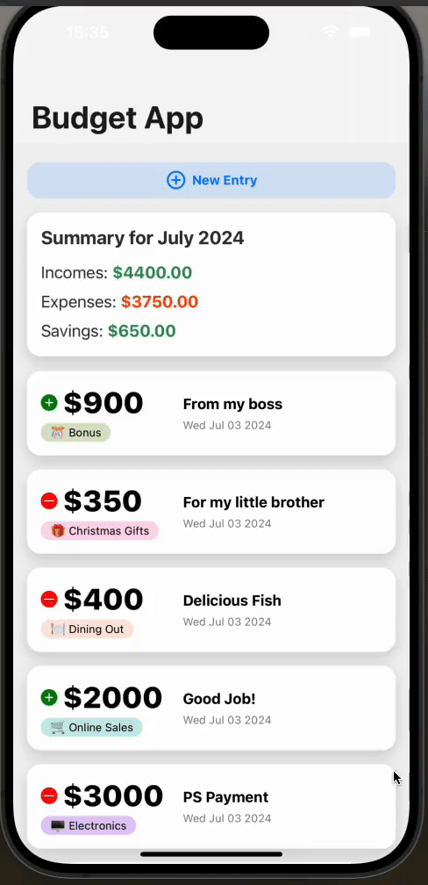

<h1>Budget App</h1>

This project is a budget management mobile application developed using React Native and Expo. The app leverages various libraries and tools to provide an efficient and user-friendly budgeting experience. It aims to help users track their income, expenses, and overall financial health with ease.

<h2>Used Technologies</h2>

<ul>
    <li>**React Native**: Utilized to build a cross-platform mobile application with native-like performance.</li>
    <li>**Expo**: Streamlines the development process by providing a set of tools and services.</li>
    <li>**Expo-file-system**: Provides access to the file system for saving and retrieving data.</li>
    <li>**React Navigation**: Integrated for smooth navigation between different screens and sections of the app.</li>
    <li>**Expo-sqlite**: Used to manage local database storage.</li>
    <li>**UI Kitten**: Leveraged for designing a visually appealing and consistent user interface with ready-to-use UI components.</li>
</ul>

<h2>Features</h2>

<ul>

 <li>**Income and Expense Tracking**: Allows users to log their income and expenses, categorizing them for better organization.</li>
 <li>**Budget Overview**: Provides a summary of the user's financial status, including total income, expenses, and remaining budget.</li>
 <li>**Data Visualization**: Displays data in charts and graphs for better understanding and analysis.</li>
 <li>**Custom Categories**: Enables users to create and manage their own categories for income and expenses.</li>
 <li>**Secure Data Storage**: Utilizes local database storage to ensure data is safely stored on the device.</li>
 <li>**Responsive Design**: Ensures compatibility across various screen sizes and orientations for a seamless user experience.</li>
</ul>

<h2>Screen Gif</h2>

